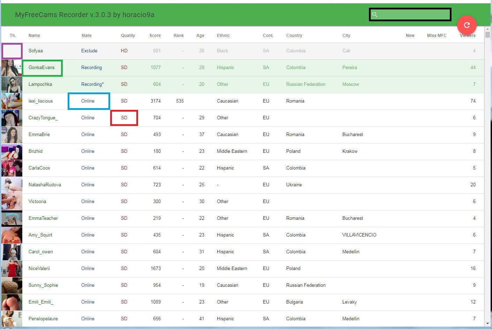
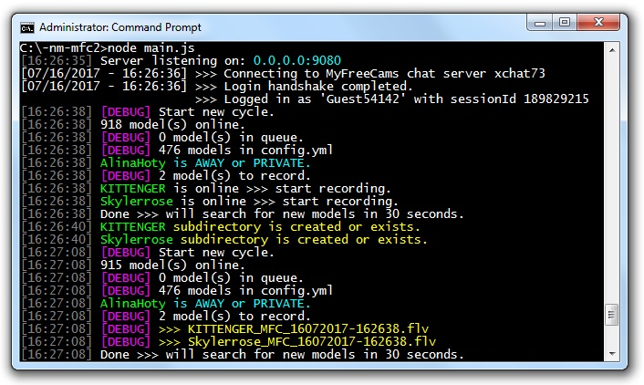
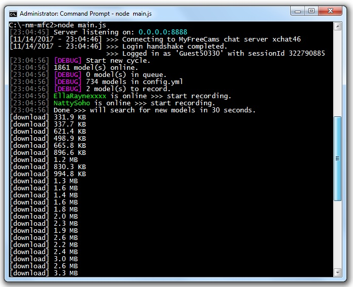

mfc-node-recorder
=================
Note: This is version has absolutely the same functionality with previous one, however, the code was simplified and cleaned from outdated parts.
mfc-node lets you follow and record your favorite models' shows on myfreecams.com
This is an attempt to create a script similar to [capturbate-node](https://github.com/SN4T14/capturebate-node) and [mfc-node](https://github.com/sstativa/mfc-node) based on different pieces of code found on the Internet.

mfc-node
==========
This is an attempt to create a script similar to [capturbate-node](https://github.com/sstativa/capturebate-node) based on different pieces of code found on the Internet.

Credits:
* [capturbate-node](https://github.com/sstativa/capturebate-node)
* [MFCAuto](https://github.com/ZombieAlex/MFCAuto)

Requirements
============
[Node.js](https://nodejs.org/download/release/) used to run mfc-node, hence the name. (tested with node v8.1.3)
[Livestreamer](https://github.com/chrippa/livestreamer/releases) last version 1.12.2 can bi installed like python module with 'pip install livestreamer==1.12.2'
[Streamlink](https://github.com/streamlink/streamlink) last version 0.9.0 can bi installed like python module with 'pip install streamlink==0.9.0'

Setup
=====
1. Install [Node.js](https://nodejs.org/download/release/) (v8.1.3 or higher).
2. Install [Git](https://git-scm.com/downloads).
2. Download and unpack the [code](https://codeload.github.com/horacio9a/mfc-node/zip/v2).
3. Open console and go into the directory where you unpacked the files.
4. Install requirements by running `npm install` in the same directory as `main.js` is.
5. Edit `config.yml` file and set desirable values for `captureDirectory`, `dateFormat` and `modelScanInterval`
6. Install [Livestreamer](https://github.com/chrippa/livestreamer/releases) last version 1.12.2 or [Streamlink](https://github.com/streamlink/streamlink) last version 0.9.0

Running
=======
1. Open console and go into the directory where you unpacked the files.
2. Start program with `node main.js`.
3. Open http://localhost:8888 in your browser. 

The list of online models will be displayed with a set of allowed commands for each model:
	* __Include__ - if you want to record the model
	* __Exclude__ - if you don't want to record the model anymore
	* __Delete__ - if you are not interested in the model and wanna hide her permanently

> Note: This is not a real-time application. Whenever your __include__, __exclude__ or __delete__ the model your changes will be applied only with the next iteration of `mainLoop` function of the script. `mainLoop` runs every 30 seconds (default value for `modelScanInterval`).

> Note: There is no __auto reload__ feature, you have to reload the list manually (__big red button__), however, keep in mind the script updates the list internally every 30 seconds (`modelScanInterval`), therefore sometimes you'll have to wait 30 seconds to see any updates.

> Note: Be mindful when capturing many streams at once to have plenty of space on disk and the bandwidth available or you’ll end up dropping a lot of frames and the files will be useless.

The MFC Recorder now captures the MFC stream in standard FLV quality, as if it was recorded eg with rtmpdump. 
That's why I think that only one directory is enough where all the files are recorded and in most cases don't need a conversion.
It also allows you to watch the recorded file during recording with possible jumps forward and back if needed.
- I added in config.yml the option to edit the 'date format' and 'file format' for the recorded file. You can choose between 'mp4' and 'ts'.
- Lot of people are asking, so I added the option that every model now has its own subdirectory
- The menu have a small preview, and when the mouse cursor is hover, it will update.
- When you click on a preview thumbnail, you get menu for include, exclude and delete models from list in config.yml.
- By pressing the model 'Name' you get a picture preview of the current model in the room. You can refresh this page later if you are interested in a new situation. If the model is called 'No Mobile Feed' then you will get a link that you can copy and start in a separate browser page and see what's happening in the room. Unfortunately, you can not record this unit with this recorder, but by pressing 'State/Online' you can watch the stream of that model in your browser. 
- By pressing 'State/Online' you can enter in the model room with your browser.
- By pressing the model 'Mob./true' you get a video preview of the current model in separate window of your browser. For this feature in My recommendation is to use the Chrome browser with the installed add-on [Play HLS M3u8](https://chrome.google.com/webstore/detail/play-hls-m3u8/ckblfoghkjhaclegefojbgllenffajdc/related) but if you want firefox then need to install [Native HLS Playback](https://addons.mozilla.org/en-US/firefox/addon/native-hls-0-7-10/?src=api)

For advanced users
==================
There are several special URLs that allow implementing some operations with a model even if she is offline.

__Include__
```
http://localhost:9080/models/include?nm=modelname
http://localhost:9080/models/include?uid=12345678
```
__Exclude__
```
http://localhost:9080/models/exclude?nm=modelname
http://localhost:9080/models/exclude?uid=12345678
```
__Delete__
```
http://localhost:9080/models/delete?nm=modelname
http://localhost:9080/models/delete?uid=12345678
```



Livestreamer version (default)



Streamelink version



